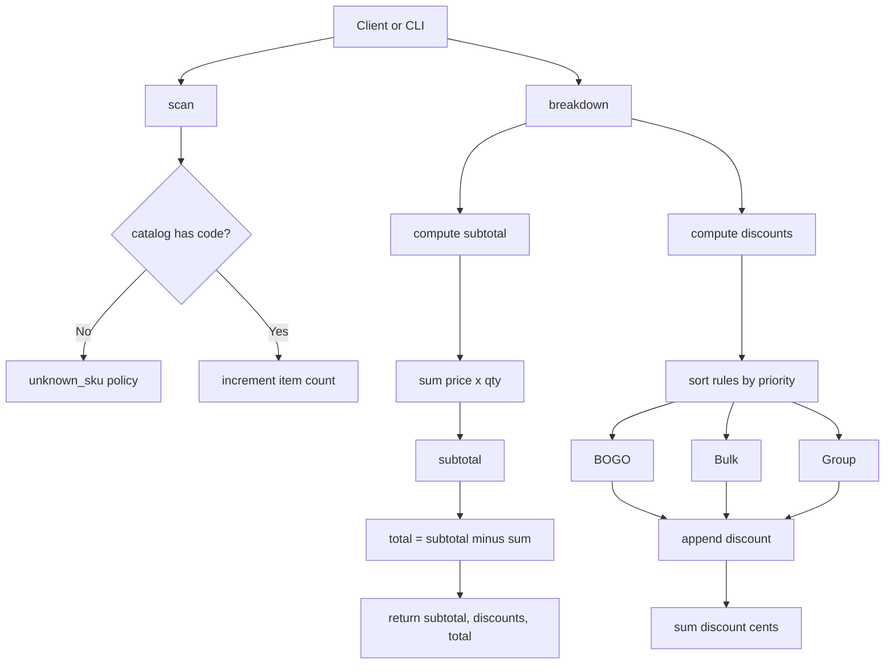

# Supermarket Checkout (Pure Ruby, TDD)

[](https://github.com/igorcubric/kantox_checkout_app/actions/workflows/ci.yml)

Minimal, extendable checkout in pure Ruby. No Rails and no DB. TDD with RSpec, Rubocop styling, SimpleCov test coverage.

## Requirements
- Ruby 3.2+
- Bundler

## Setup
```bash
ruby -v
gem install bundler
bundle install
bundle exec rubocop
bundle exec rspec
```

## Usage

### IRB
```ruby
require_relative "lib/checkout"
require_relative "lib/catalog"

rules = [
  Pricing::BuyOneGetOneFree.new(code: "GR1"),
  Pricing::BulkPriceOverride.new(code: "SR1", threshold: 3, new_unit_price_cents: 450),
  Pricing::GroupPriceFraction.new(code: "CF1", threshold: 3, numerator: 2, denominator: 3)
]

co = Checkout.new(pricing_rules: rules, catalog: Catalog.default)
%w[GR1 SR1 GR1 GR1 CF1].each { |code| co.scan(code) }
puts co.total.to_s  # => "£22.45"
```

### CLI
```bash
bin/checkout GR1 SR1 GR1 GR1 CF1
# Subtotal: £25.56
# Discounts:
#   - BuyOneGetOneFree (GR1): -£3.11
# Total:    £22.45
```

## How it works
- `Checkout#scan(code)` accumulates amounts by SKU.
- `breakdown` returns:
    - `subtotal` = Σ(unit_price * qty) by SKU
    - `discounts` = list {label, code, amount} by `priority`
    - `total` = `subtotal − Σ(discounts)`

### Architecture (flow diagram)


#### ASCII fallback
```
Client/CLI
  ├─ scan(code) -> Catalog.exists? -> no -> unknown_sku(:error/:skip)
  │                                └-> yes -> items[code] += 1
  └─ breakdown
      ├─ compute_subtotal = Σ price(SKU) * qty
      ├─ compute_discounts:
      │     rules.sort_by(:priority).each -> discount -> discounts[]
      └─ total = subtotal − Σ(discounts.amount)
         => { subtotal, discounts[], total }
```

## Testing
- Integration and invariants (order-invariant, subtotal − discounts = total).
- Rules: unit and property-based tests (`Rantly`).

### Property-based
```bash
bundle exec rspec spec/pricing_rules_property_spec.rb
```

## Mutation testing
Mutant checks the strength of tests by mutating the code.

### Locally
Public repo:
```bash
bundle exec mutant run --usage opensource --use rspec 'Money*' 'Pricing*'
```
Private repo:
```bash
bundle exec mutant run --usage commercial --use rspec 'Money*' 'Pricing*'
```

### Config (`mutant.yml`)
```yaml
usage: opensource
integration: rspec
includes: [lib]
requires: [mutant-rspec]
matcher:
  subjects:
    - Money*
    - Pricing*
```

## Structure
```
lib/
  checkout.rb
  money.rb
  product.rb
  catalog.rb
  pricing/
    rule.rb
    buy_one_get_one_free.rb
    bulk_price_override.rb
    group_price_fraction.rb
spec/
  *_spec.rb
  pricing_rules_property_spec.rb
bin/
  checkout
.github/workflows/
  ci.yml
docs/adr/
  0001-pricing-rules.md
```

## License
MIT